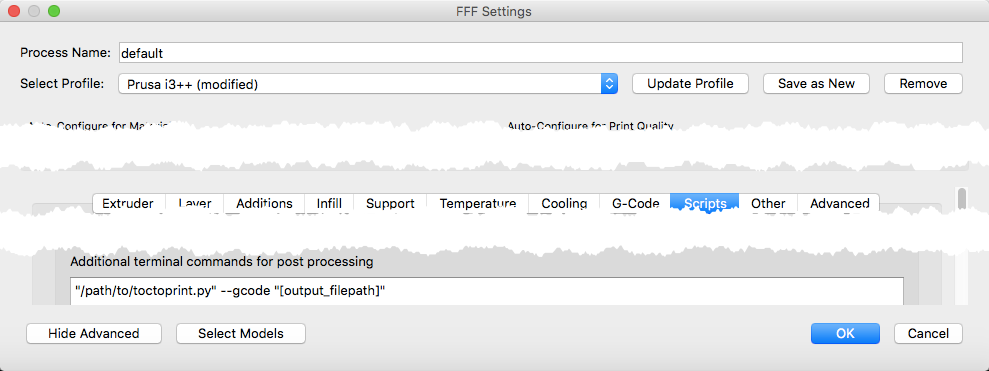

Developed for OSX. With (minor?) changes, could be usefull on other platforms as well.

###Install:

```
brew install terminal-notifier
brew install trash
sudo easy_install python-daemon
sudo easy_install configparser
```

### Usage

`/path/to/toctoprint.py select print trash --location ~/Desktop --editor /usr/local/bin/mate --server http://octoprint.local --key 00000000000000000  --gcode ~/Desktop/gcode.gcode`


Except for the parameter --gcode all options can be set in `ini` file

You can create `.toctoprint.ini` in your home folder with any (or all) following settings or pass as command line parameters

```
[default]
#OctoPrint setting
SERVER = http://octoprint.local
#this has to be set either in the `ini` file or passed as command line parameter
OCTOPRINT_KEY = 00000000000000000000000

#only gcode files created to this folder will be uploaded
DEFAULT_LOCATION = ~/Desktop

#change this to None if you don't want to open when saving to a different path
EDITOR = /usr/local/bin/mate

#remove local gcode file after uploading to Octoprint
TRASH = True

#select file after upload
SELECT = False 

#start print after upload
PRINT = False 
```

###ini file settings vs command line

```
SERVER | --server
OCTOPRINT_KEY | --key
DEFAULT_LOCATION | --location 
EDITOR | --editor
TRASH | trash
SELECT | select
PRINT | print
```

Add this to post procesing script in Simplify3D:

`/path/to/toctoprint.py select trash --location ~/Desktop --editor /usr/local/bin/mate --key 00000000000000000 --server http://octoprint.local --gcode [output_filepath]`

- settings passed as parameters overwrite the ones in the ini file.
- [output_filepath] will be replaced by Simplify3D with the full path of the saved GCODE file.




