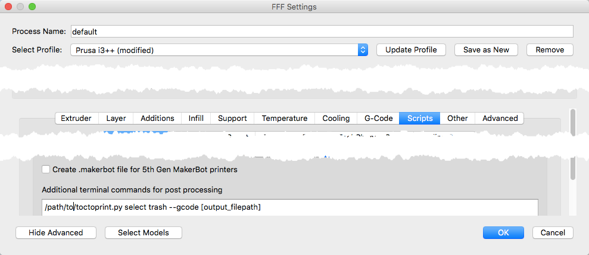

For OSX only. With changes, might be usefull on other platforms as well.

Install

```
brew install terminal-notifier
brew install trash
sudo easy_install python-daemon
sudo easy_install configparser
```

Except for the parameter --gcode all options can be set in `ini` file

You can create `.toctoprint.ini` in your home folder with any (or all) following settings or pass as command line parameters

```
[default]
#Octoprint setting
#--server (default http://octoprint.local)
SERVER = http://octoprint.local
#--key (default 'none' - this has to be set either in the `ini` file or passed as command line parameter)
OCTOPRINT_KEY = 00000000000000000000000

#only gcode files created to this folder will be uploaded
#--location 
DEFAULT_LOCATION = ~/Desktop

#change this to None if you don't want to open when saving to a different path
#--editor
EDITOR = /usr/local/bin/mate

#remove local gcode file after uploading to Octoprint
#trash
TRASH = True

#select file after upload
#select
SELECT = False 

#start print after upload
#print
PRINT = False 
```


Add this to post procesing script in Simplify3D

`"/path/to/toctoprint.py" select trash --location ~/Desktop --editor /usr/local/bin/mate --key 00000000000000000 --server http://octoprint.local --gcode [output_filepath]`

Settings passed as parameters overwrite the ones in the ini file



